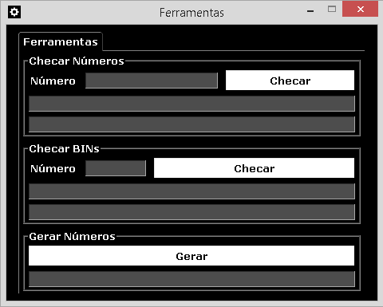
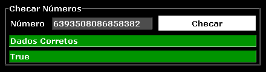
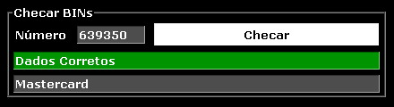
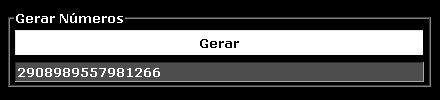

# Ferramentas

Este repositório contém um programa desenvolvido em `Python`. Ele oferece ferramentas relevantes para o tratamento de números e BINs de cartões de crédito, proporcionando que os usuários façam checagens assíncronas e gerações rápidas.

## Uso

**Nota:** O programa está empacotado como um arquivo executável. Portanto, você não precisa instalar nada no seu computador.

1. Faça o `Download` deste repositório.
2. Dentro da pasta `Programa`, execute o arquivo `Ferramentas.exe`.

## Funções

### Checar Números

**Nota:** O processo de checagem dos números de cartão acontece com base no `Algoritmo de Luhn`.

1. Escreva qualquer número de cartão de crédito com dezesseis dígitos e pressione o botão `Checar`.
2. O retorno pode apresentar os seguintes resultados:
    - **Dados Corretos:** Caso o formato do número fornecido pelo usuário atenda aos requisitos.
    - **Dados Incorretos:** Caso o formato do número fornecido pelo usuário não atenda aos requisitos.
3. O resultado aparecerá no campo correspondente, podendo ser:
    - **True:** Caso o número do cartão fornecido pelo usuário for válido.
    - **False:** Caso o número do cartão fornecido pelo usuário for inválido.

### Checar BINs

**Nota:** O processo de checagem assíncrona das BINs acontece usando a `BIN Checker API` da plataforma `APILayer`.

1. Escreva qualquer BIN de cartão de crédito com seis dígitos e pressione o botão `Checar`.
2. O retorno pode apresentar os seguintes resultados:
    - **Dados Corretos:** Caso o formato da BIN fornecida pelo usuário atenda aos requisitos.
    - **Dados Incorretos:** Caso o formato da BIN fornecida pelo usuário não atenda aos requisitos.
    - **Não Encontrado:** Caso o formato da BIN fornecida pelo usuário atenda aos requisitos, mas for inexistente.
    - **Aguarde:** Caso a API extrapole o prazo de 5 segundos para responder, o usuário poderá tentar novamente.
3. O resultado aparecerá no campo correspondente sendo, nesse caso, a bandeira do cartão a qual a BIN pertence.

### Gerar Números

**Nota:** O processo de geração dos números de cartão acontece com base no `Algoritmo de Luhn`.

1. Pressione o botão `Gerar`.
2. O resultado aparecerá no campo correspondente sendo, nesse caso, o número gerado.

## Licença

**[MIT License](LICENSE.md)**